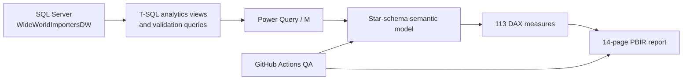

# SupplyChain360 — Power BI Supply Chain Analytics


A version-controlled Power BI project for supply-chain analysis across **inventory, procurement, order fulfillment, sales, profitability and stock movement**.

The project uses Microsoft **WideWorldImportersDW** as the source warehouse and focuses on the parts of BI work that matter beyond visual design: SQL preparation, dimensional modeling, Power Query, DAX, data-quality checks, row-level security, source control and automated QA.

## What the project answers

- Which SKUs are understocked, overstocked or need replenishment?
- Where is excess inventory value concentrated?
- Which suppliers have open or short-received purchase orders?
- Which customers/products are driving backorders?
- How are revenue, profit and demand changing over time?
- Which products have the highest stock movement or net outflow?
- Can regional users be restricted to the geography they are allowed to see?

## Architecture



### Semantic model

**Facts**
- Fact Inventory
- Fact Procurement
- Fact Order Fulfillment
- Fact Sales Demand
- Fact Stock Movement

**Conformed dimensions**
- Dim Date
- Dim Stock Item
- Dim Supplier
- Dim Customer
- Dim City
- Dim Employee
- Dim Transaction Type

The model uses one-to-many dimension-to-fact relationships, hidden technical keys, explicit measures, role-playing date relationships and `USERELATIONSHIP()` where required.

## Dashboard pages

| # | Page | Focus |
|---:|---|---|
| 01 | Executive Overview | Headline supply-chain KPIs |
| 02 | Inventory Intelligence | Inventory health, value and replenishment |
| 03 | Inventory Risk Detail | SKU-level reorder/excess risk |
| 04 | Procurement & Supplier Performance | Purchase and receipt performance |
| 05 | Supplier Exceptions & Procurement Risk | Open orders and receipt shortfalls |
| 06 | Order Fulfillment & Backorders | Order and picking performance |
| 07 | Fulfillment Exceptions | Backorder hotspots and exceptions |
| 08 | Sales & Demand Intelligence | Revenue, demand and geography |
| 09 | Profitability & Customer Insights | Profit, margin and customer economics |
| 10 | Stock Movement & Operations | Stock in/out and movement mix |
| 11 | Movement Exceptions | Net-outflow and movement risk |
| 12 | Product 360 | Cross-domain product view |
| 13 | Supplier 360 | Cross-domain supplier view |
| 14 | Data Quality & Model QA | Reconciliation and acceptance checks |

## Engineering features

- **SQL analytics layer** — reusable views for the five analytical domains
- **SQL validation layer** — KPI and row-level reconciliation checks
- **Power Query** — selected-column loading, source parameterization and date-range filters
- **113 explicit DAX measures** — inventory, procurement, fulfillment, sales, profitability and movement KPIs
- **Dynamic RLS** — Executive and Regional Manager roles using `USERPRINCIPALNAME()`
- **Environment parameters** — `ServerName`, `DatabaseName`, `EnvironmentName`
- **Incremental-refresh readiness** — `RangeStart` / `RangeEnd` filters on growing fact tables
- **PBIP / PBIR / TMDL source control** — report and semantic-model definitions are stored as text
- **Automated QA** — GitHub Actions validates report/model structure and all 14 pages on every push/PR

## Quality checks

The repository contains two automated validators:

```bash
python scripts/validate_powerbi_project.py
python scripts/audit_report_pages.py
```

Current page audit result: **14/14 PASS**.

The audit checks:
- PBIP/PBIR/TMDL structure
- JSON validity
- registered pages and visuals
- visual field/measure references
- semantic-model relationships
- RLS metadata
- source parameters
- range filters
- accidental PBIX/PBIT commits
- page-specific regression checks

See [final-page-audit.md](docs/final-page-audit.md) for the latest page-by-page result.

## Repository structure

```text
.
├── .github/workflows/       # CI validation
├── deployment/              # environment parameter examples
├── docs/                    # design, KPI and QA documentation
├── powerbi/
│   ├── SupplyChain360.pbip
│   ├── SupplyChain360.Report/
│   └── SupplyChain360.SemanticModel/
├── scripts/                 # QA and release utilities
└── sql/
    ├── setup/
    ├── views/
    ├── validation/
    └── security/
```

## Run locally

### Prerequisites

- SQL Server
- SQL Server Management Studio
- Power BI Desktop with PBIP support
- Python 3.10+
- WideWorldImportersDW restored locally

### 1. Clone

```powershell
git clone https://github.com/rjraunak04/supplychain360-powerbi-analytics.git
cd supplychain360-powerbi-analytics
```

### 2. Install the SQL analytics layer

In SSMS, run:

```text
sql/setup/00_install_analytics_layer.sql
```

Then run the validation scripts under `sql/validation/`.

### 3. Run repository QA

```powershell
python .\scripts\validate_powerbi_project.py
python .\scripts\audit_report_pages.py
```

### 4. Open Power BI

Open:

```text
powerbi/SupplyChain360.pbip
```

Default development parameters:

```text
ServerName   = localhost
DatabaseName = WideWorldImportersDW
Environment  = DEV
```

Run **Refresh All** and review page **14 — Data Quality & Model QA**.

## Documentation

The most useful technical notes are:

- [Business requirements](docs/business-requirements.md)
- [Data model](docs/data-model.md)
- [KPI dictionary](docs/kpi-dictionary.md)
- [DAX measures](docs/dax-measures.md)
- [Dashboard design](docs/dashboard-design.md)
- [Architecture decisions](docs/architecture-decisions.md)
- [Security / RLS](docs/security-rls.md)
- [Environment configuration](docs/environment-configuration.md)
- [Incremental refresh](docs/incremental-refresh.md)
- [Testing strategy](docs/testing-strategy.md)
- [CI/CD](docs/ci-cd.md)
- [Final 14-page audit](docs/final-page-audit.md)

## Notes

- The source data is Microsoft sample data, not production company data.
- PBIX/PBIT binaries are intentionally excluded from Git; PBIP/PBIR/TMDL source is used instead.
- Power BI Service publication and gateway configuration are deployment extensions, not required to reproduce the local project.

## License

MIT.
