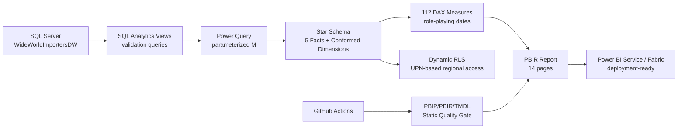

# SupplyChain360 — Enterprise Power BI Supply Chain Control Tower


**Inventory • Procurement • Supplier Performance • Fulfillment • Sales • Profitability • Stock Movement**

SupplyChain360 is an end-to-end Business Intelligence engineering project built on Microsoft SQL Server and Power BI. It demonstrates not only dashboard design, but also dimensional modeling, SQL analytics views, Power Query engineering, advanced DAX, PBIP/PBIR/TMDL source control, dynamic row-level security, environment parameterization, incremental-refresh readiness, automated CI validation, and production deployment planning.

> **Project status:** source/model/report engineering is complete and under automated static QA. Final portfolio publication still requires a successful local Refresh All, runtime performance capture, RLS test evidence, and optional Power BI Service publication.

---

## Business problem

Supply-chain teams frequently manage inventory, purchasing, fulfillment, sales and movement data in separate operational views. This makes it difficult to answer cross-functional questions such as:

- Which SKUs need replenishment now?
- Where is working capital tied up in excess inventory?
- Which suppliers have outstanding purchase exposure?
- Which products/customers are driving backorders?
- How are revenue, profit and delivery performance changing?
- Which items have abnormal net stock outflow?
- Can a manager securely see only the geography they own?

SupplyChain360 brings these questions into one governed semantic model and 14-page decision-support application.

---

## Architecture



### Data flow

`SQL Server → Power Query → Star Schema → DAX → PBIR Report → Power BI Service`

---

## Technology stack

| Layer | Technology |
|---|---|
| Database | Microsoft SQL Server 2025 Developer |
| Source | Microsoft Wide World Importers DW |
| SQL | T-SQL analytics views + validation/reconciliation queries |
| ETL / shaping | Power Query (M) |
| Semantic model | Power BI Import model / TMDL |
| Modeling | Star schema, conformed dimensions, inactive role-playing relationships |
| Analytics | 112 explicit DAX measures |
| Reporting | Power BI PBIR report definitions |
| Source control | PBIP + PBIR + TMDL + Git |
| Security | Dynamic RLS with `USERPRINCIPALNAME()` |
| CI | GitHub Actions + Python static validation |
| Deployment design | DEV / TEST / PROD, gateway, scheduled refresh, incremental refresh |

---

## Semantic-model design

### Fact domains

- Fact Inventory
- Fact Procurement
- Fact Order Fulfillment
- Fact Sales Demand
- Fact Stock Movement

### Conformed dimensions

- Dim Date
- Dim Stock Item
- Dim Supplier
- Dim Customer
- Dim City
- Dim Employee
- Dim Transaction Type

### Engineering choices

- No direct fact-to-fact relationships
- Hidden technical/surrogate keys
- Explicit centralized measure table
- Display folders for DAX measures
- Inactive relationships for alternative date/customer roles
- `USERELATIONSHIP()` for role-playing analysis
- Current-state inventory SCD safeguards
- Parameterized SQL Server / database source
- RangeStart / RangeEnd filters on large transactional facts

See [Architecture Decisions](docs/architecture-decisions.md) and [Semantic Model](docs/semantic-model.md).

---

## Report pages

| # | Page | Primary purpose |
|---:|---|---|
| 01 | Executive Overview | Enterprise KPI control tower |
| 02 | Inventory Intelligence | Inventory value, health, reorder and excess exposure |
| 03 | Inventory Risk Detail | SKU-level replenishment and excess-risk register |
| 04 | Procurement & Supplier Performance | Purchase volume, receipts, fulfillment and suppliers |
| 05 | Supplier Exceptions & Procurement Risk | Outstanding procurement and exception analysis |
| 06 | Order Fulfillment & Backorders | Order flow, picking and backorder performance |
| 07 | Fulfillment Exceptions | Customer/product fulfillment hotspots |
| 08 | Sales & Demand Intelligence | Revenue, units, customer/product demand |
| 09 | Profitability & Customer Insights | Profit, margin and loss-making exposure |
| 10 | Stock Movement & Operations | Stock-in/out, movement mix and velocity |
| 11 | Movement Exceptions | Net-outflow and movement-risk analysis |
| 12 | Product 360 | Cross-domain product view |
| 13 | Supplier 360 | Cross-domain supplier view |
| 14 | Data Quality & Model QA | Semantic-model acceptance and reconciliation |

---

## Key KPI families

### Inventory
- Total Inventory Value
- Quantity On Hand
- Stockout SKUs
- Reorder Required SKUs
- Overstock SKUs
- Inventory Health %
- Reorder Gap Units / Value
- Excess Inventory Units / Value

### Procurement
- Purchase Orders
- Ordered / Received / Outstanding Quantity
- Procurement Fulfillment %
- Purchase Order Completion %
- Open Purchase Orders
- Receipt Shortfall Lines

### Fulfillment
- Total Orders
- Backordered Lines / Units
- Backorder Rate %
- Average Days to Pick
- Picking Speed / fulfillment status

### Sales & profitability
- Total Revenue
- Total Profit
- Profit Margin %
- Units Sold
- Revenue YTD / LY / YoY
- Loss-making exposure
- Customer/product profitability

### Stock movement
- Stock In Quantity
- Stock Out Quantity
- Net Stock Movement
- Movement Events
- Movement Volume / net outflow

Full measure documentation: [DAX Measures](docs/dax-measures.md).

---

## Security

The semantic model contains:

- **Executive** role — enterprise-wide read
- **Regional Manager** role — dynamic geography filtering using `USERPRINCIPALNAME()`
- hidden **Security User Access** mapping table

The checked-in mappings use demonstration `@contoso.com` identities only. Production deployments should replace them with a governed access source.

See [Security & RLS](docs/security-rls.md).

---

## Environment & refresh engineering

Model parameters:

- `ServerName`
- `DatabaseName`
- `EnvironmentName`
- `RangeStart`
- `RangeEnd`

Large transactional facts apply date-range filters to support incremental-refresh deployment patterns.

See:
- [Environment Configuration](docs/environment-configuration.md)
- [Incremental Refresh](docs/incremental-refresh.md)

---

## Automated quality gate

Every push and pull request to `main` runs:

```bash
python scripts/validate_powerbi_project.py
```

The validator checks:

- PBIP/PBIR/TMDL required assets
- PBIR JSON parsing
- registered report pages
- relationship references
- environment parameters
- dynamic RLS metadata
- incremental-range filters
- SQL analytics/validation coverage
- accidental PBIX/PBIT binaries
- local Power BI cache hygiene
- minimum DAX measure coverage

Workflow: `.github/workflows/powerbi-ci.yml`

---

## Repository structure

```text
.
├── .github/workflows/
│   └── powerbi-ci.yml
├── docs/
│   ├── architecture-decisions.md
│   ├── business-requirements.md
│   ├── dashboard-design.md
│   ├── data-model.md
│   ├── dax-measures.md
│   ├── environment-configuration.md
│   ├── incremental-refresh.md
│   ├── performance-tuning.md
│   ├── power-bi-service-deployment.md
│   ├── recruiter-walkthrough.md
│   ├── security-rls.md
│   ├── testing-strategy.md
│   └── ...
├── powerbi/
│   ├── SupplyChain360.pbip
│   ├── SupplyChain360.Report/
│   └── SupplyChain360.SemanticModel/
├── scripts/
│   ├── build_final_powerbi.py
│   └── validate_powerbi_project.py
└── sql/
    ├── views/
    └── validation/
```

---

## Run locally

### Prerequisites

- Windows
- SQL Server
- SQL Server Management Studio
- Power BI Desktop with PBIP support
- WideWorldImportersDW restored locally
- Python 3.10+ for static validation

### 1. Clone

```powershell
git clone https://github.com/rjraunak04/supplychain360-powerbi-analytics.git
cd supplychain360-powerbi-analytics
```

### 2. Run static QA

```powershell
python scripts/validate_powerbi_project.py
```

### 3. Create/refresh SQL analytics layer

Run this one-shot installer first in SSMS:

```text
sql/setup/00_install_analytics_layer.sql
```

Then run the validation scripts under:

```text
sql/validation/
```

The Power BI model expects the `analytics` schema views to exist before Refresh All.

### 4. Open Power BI

Open:

```text
powerbi/SupplyChain360.pbip
```

Default development parameters:

```text
ServerName   = localhost
DatabaseName = WideWorldImportersDW
Environment  = DEV
```

Run **Refresh All**, then validate page 14: **Data Quality & Model QA**.

---

## Production-readiness checklist

- [x] SQL analytics layer
- [x] SQL validation/reconciliation layer
- [x] Star schema
- [x] 112 explicit DAX measures
- [x] PBIP/PBIR/TMDL source control
- [x] Environment parameters
- [x] Dynamic RLS design
- [x] RangeStart/RangeEnd filters
- [x] GitHub Actions static quality gate
- [x] Performance tuning runbook
- [x] Service/gateway deployment runbook
- [x] Accessibility/mobile checklist
- [ ] Final local Refresh All evidence
- [ ] Performance Analyzer screenshots
- [ ] RLS View-as / Service evidence
- [ ] Power BI Service refresh-history screenshot
- [ ] Mobile layout screenshot

The unchecked items require an interactive Power BI Desktop/Service session and are intentionally not fabricated in source control.

---

## Portfolio evidence

After final runtime validation, add sanitized screenshots to `docs/images/`.

Recommended evidence:
- Executive Overview
- Inventory Intelligence
- Procurement/Supplier page
- Product 360
- Model view
- Performance Analyzer
- successful refresh history
- RLS test
- mobile layout

See [Screenshot Checklist](docs/images/README.md).

---

## Interview walkthrough

A concise 30-second project pitch and 3-minute technical demo flow are documented in [Recruiter / Interview Walkthrough](docs/recruiter-walkthrough.md).

---

## Testing & performance

- [Testing Strategy](docs/testing-strategy.md)
- [Performance Engineering](docs/performance-tuning.md)
- [Final QA / Deployment](docs/final-qa-deployment.md)

---

## License

MIT License.


---

## Further engineering documentation

- [Stage 15 — Production & Recruiter Hardening](docs/stage-15-production-hardening.md)
- [Architecture Decisions](docs/architecture-decisions.md)
- [Data Governance & Lineage](docs/data-governance-lineage.md)
- [Security & RLS](docs/security-rls.md)
- [Object-Level Security Design](docs/object-level-security.md)
- [Environment Configuration](docs/environment-configuration.md)
- [Incremental Refresh Strategy](docs/incremental-refresh.md)
- [Performance Engineering](docs/performance-tuning.md)
- [Testing Strategy](docs/testing-strategy.md)
- [CI/CD Strategy](docs/ci-cd.md)
- [Monitoring & Operational SLA](docs/monitoring-and-sla.md)
- [Power BI Service Deployment](docs/power-bi-service-deployment.md)
- [Release Gate Checklist](docs/release-checklist.md)
- [Accessibility & Mobile](docs/accessibility-mobile.md)
- [Recruiter Walkthrough](docs/recruiter-walkthrough.md)
- [Recruiter Skill Matrix](docs/recruiter-skill-matrix.md)

Interactive runtime evidence is tracked in GitHub Issue #1.
