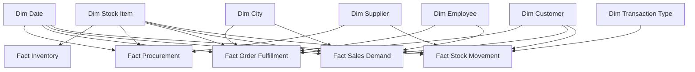

# SupplyChain360 — Dimensional Data Model

## Modeling approach

SupplyChain360 uses a multi-fact star-schema architecture. Descriptive attributes live in conformed dimensions and transactional measures live in domain-specific facts.

This design keeps filter propagation predictable, reduces duplicated descriptive data and allows Product 360 / Supplier 360 analysis across business processes.

## High-level model

## Fact grains

| Semantic fact | Grain | Core use |
|---|---|---|
| Fact Inventory | current stock-holding row per stock item | on-hand, reorder, excess inventory, inventory value |
| Fact Procurement | purchase-order line / stock item | ordered, received, outstanding procurement |
| Fact Order Fulfillment | customer order line | order volume, backorders, picking performance |
| Fact Sales Demand | sale/invoice line | revenue, profit, units, customer/product demand |
| Fact Stock Movement | inventory movement event | stock in/out, movement velocity, operational flow |

## Conformed dimensions

| Dimension | Reused by |
|---|---|
| Dim Date | Procurement, Orders, Sales, Movement |
| Dim Stock Item | all five fact domains |
| Dim Customer | Orders, Sales, Movement |
| Dim Supplier | Procurement, Movement |
| Dim City | Orders, Sales |
| Dim Employee | Orders, Sales |
| Dim Transaction Type | Movement |

## Relationship rules

- Dimension-to-fact relationships use one-to-many cardinality where supported by the warehouse keys.
- Dimensions filter facts; single-direction filtering is preferred.
- Direct fact-to-fact relationships are avoided.
- Technical/surrogate keys are hidden from report consumers.
- Descriptive slicers come from dimensions rather than duplicated fact attributes.
- Alternative business dates are modeled through inactive relationships and activated in measures with `USERELATIONSHIP()`.

## Role-playing relationship examples

- Invoice Date vs Delivery Date
- Order Date vs Picked Date
- Customer vs Bill-To Customer
- Salesperson vs Picker where applicable

## Inventory current-state safeguard

Wide World Importers includes slowly changing dimension history for Stock Item. The inventory query restricts dimensional lookup to the current Stock Item version so historical surrogate versions do not inflate current inventory KPIs.

## Security model

A hidden `Security User Access` table supports the dynamic Regional Manager RLS role. The role filters `Dim City`, allowing security to propagate from a dimension into relevant facts instead of applying repeated fact-level security expressions.

## Modeling quality principles

- Define business grain before measures.
- Keep one authoritative definition per KPI.
- Keep row-level reusable transformations near SQL/Power Query.
- Keep filter-context calculations in DAX.
- Use explicit measures instead of relying on implicit sums for business KPIs.
- Keep relationship paths simple enough to explain during code review/interviews.
